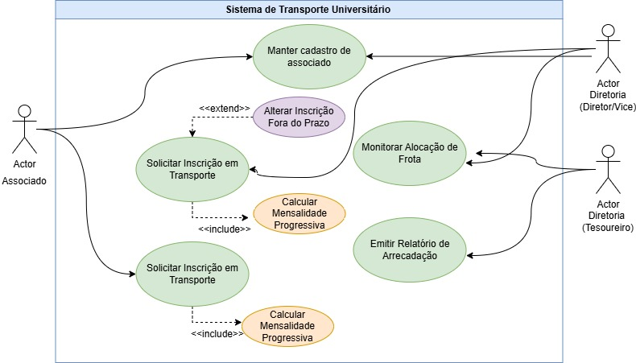
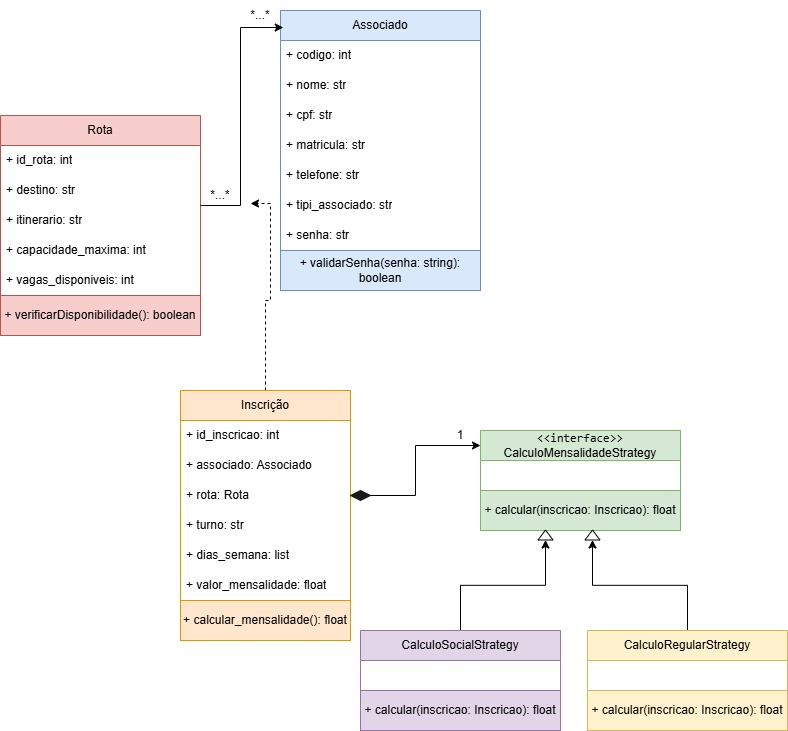
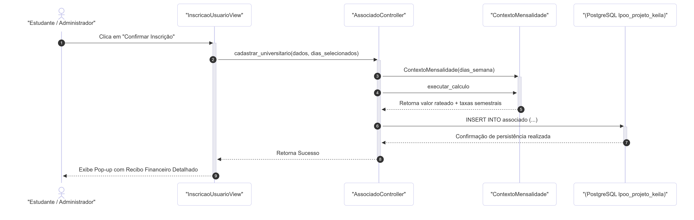

# Documentação do Projeto - Sistema de Transporte Estudantil

**Disciplina:** Análise e Projeto de Sistemas (APS) & Linguagem de Programação Orientada a Objetos (LPOO)  
**Aluno:** Keila de Sales Gonçalves

---

## 1. Descrição e Delimitação do Escopo

### Cenário do Sistema e Propósito
O Sistema de Transporte Estudantil tem como propósito gerenciar o fluxo de inscrições, alocação de frota e controle financeiro de estudantes universitários que se deslocam diariamente de Lagoa Vermelha para os polos universitários de Passo Fundo. Atualmente, a associação lida com uma média de 140 associados pulverizados em diferentes turnos (tarde e noite), necessitando de uma ferramenta automatizada para extinguir o controle por planilhas manuais.

### Problema Resolvido
O sistema resolve o problema de dimensionamento de frota e precificação justa. Antes do encerramento do prazo de inscrição, a diretoria não possuía dados exatos de quantos alunos utilizavam o transporte por dia da semana e por turno específico (considerando que há estudantes que vão à tarde e retornam no turno da noite). O sistema consolida esses dados e sugere a frota necessária (vans, micro-ônibus ou ônibus), além de calcular a mensalidade de forma progressiva (premiando com diárias mais baratas os alunos frequentes e aplicando as taxas corretas de Matrícula e Rematrícula).

### Público-Alvo e Níveis de Acesso
1. **Estudante Associado:** Realiza autocadastro, solicita inscrição informando turnos de ida/volta e dias da semana, e consulta suas mensalidades.
2. **Diretoria (Tesoureiro):** Acessa o painel financeiro, relatórios de arrecadação e conferência de custos.
3. **Administrador (Diretor/Vice):** Possui controle total para alterar cadastros após o fechamento dos prazos e reconfigurar valores do sistema na Tela de Monitoramento.

### Escalabilidade do Escopo
*Nota de Projeto:* Embora o sistema seja inicialmente homologado para a rota Lagoa Vermelha x Passo Fundo, a arquitetura de banco de dados e as classes de domínio foram projetadas para suportar múltiplas cidades e novos trajetos no futuro apenas alimentando as tabelas correspondentes, sem necessidade de alteração no código-fonte.

---

## 2. Fase de Análise (Requisitos e Regras)

### 2.1 Requisitos Funcionais (RF)

O sistema deve atender, no mínimo, aos seguintes requisitos de negócio:

* **RF001 - Autenticação por Perfil:** O sistema deve permitir o login diferenciado para Estudantes, Diretoria e Administradores.
* **RF002 - Cadastro de Associados (CRUD):** O sistema deve permitir a inclusão, alteração, consulta e exclusão de estudantes associados, identificando se são "Novos" ou "Antigos".
* **RF003 - Cadastro de Rotas (CRUD):** O sistema deve permitir o gerenciamento de rotas, incluindo o nome do trajeto e a cidade de destino.
* **RF004 - Solicitação de Inscrição:** O sistema deve permitir ao associado vincular-se a uma rota escolhendo de 1 a 5 dias da semana, o turno de ida e o turno de volta.
* **RF005 - Bloqueio de Inscrição por Prazo:** O sistema deve impedir que associados alterem ou façam novas inscrições após a data limite estipulada pela diretoria.
* **RF006 - Alteração Administrativa Exclusiva:** O sistema deve permitir que apenas o perfil de Administrador altere os dias da semana ou cancele cadastros após o encerramento do prazo de inscrições.
* **RF007 - Cálculo de Mensalidade Automatizado (Pattern Strategy):** O sistema deve calcular o valor da mensalidade aplicando o preço correspondente aos dias da semana escolhidos e injetar a taxa de matrícula (R$ 200) ou rematrícula (R$ 80) conforme o tipo do associado.
* **RF008 - Monitoramento e Otimização de Frota:** O sistema deve exibir para a diretoria a soma total de alunos por dia da semana e turno, recomendando a combinação ideal de veículos (Van para até 15 alunos, Micro-ônibus para até 30, e Ônibus para até 45).
* **RF009 - Relatório de Arrecadação:** O sistema deve fornecer ao perfil de Tesoureiro um demonstrativo financeiro com a previsão de receita mensal baseada nas inscrições ativas.
* **RF010 - Histórico Financeiro do Aluno:** O sistema deve exibir para o associado logado os seus débitos vigentes, discriminando a mensalidade base e a taxa de adesão semestral.

### 2.2 Requisitos Não Funcionais (RNF)

Os requisitos não funcionais definem as restrições técnicas, qualidades e características de infraestrutura do sistema:

* **RNF001 - Linguagem de Programação:** O sistema deve ser desenvolvido obrigatoriamente utilizando a linguagem Python.
* **RNF002 - Sistema Gerenciador de Banco de Dados (SGBD):** A persistência dos dados deve ser realizada em um banco de dados relacional PostgreSQL.
* **RNF003 - Interface Gráfica (GUI):** A interface com o usuário deve ser construída utilizando a biblioteca Tkinter, garantindo padronização visual nativa e facilidade de uso pela diretoria.
* **RNF004 - Padrão de Arquitetura:** O código fonte do sistema deve ser estruturado utilizando a separação de responsabilidades em módulos/pacotes com as iniciais maiúsculas (Model, View, Controller e DAO).
* **RNF005 - Operação Local:** O sistema deve funcionar de forma totalmente local/offline, armazenando e consultando os dados diretamente no servidor PostgreSQL configurado, sem depender de conexão com a internet externa para sua execução diária.

### 2.3 Regras de Negócio (RN)

As regras de negócio descrevem as políticas operacionais da Associação (ALU) aplicadas ao software:

* **RN001 - Política de Desconto Progressivo e Adesão:** O cálculo da mensalidade base deve aplicar taxas fixas decrescentes de acordo com a frequência de dias escolhidos (1 dia: R$ 280,00; 2 dias: R$ 240,00; 3 dias: R$ 200,00; 4 dias: R$ 180,00; 5 dias: R$ 160,00). Adicionalmente, no primeiro mês do semestre correspondente ao contrato, associados categorizados como "NOVO" sofrem acréscimo de R$ 200,00 (Matrícula) e associados "ANTIGO" sofrem acréscimo de R$ 80,00 (Rematrícula).
* **RN002 - Parametrização para Dimensionamento de Frota:** A lógica de recomendação automática de veículos na **Tela de Monitoramento** deve obedecer rigorosamente à capacidade limite dos modais cadastrados:
  * Até 15 alunos alocados no turno específico: Sugerir **Van**.
  * De 16 a 30 alunos alocados no turno específico: Sugerir **Micro-ônibus**.
  * De 31 a 45 alunos alocados no turno específico: Sugerir **Ônibus** (Capacidade 45).
  * Acima de 45 alunos: Combinar os veículos de forma incremental e somatória (Exemplo: 60 alunos = 1 Ônibus + 1 Van).

## 3. Diagrama de Casos de Uso

### 3.1 Representação Visual do Sistema

  

### 3.2 Documentação Textual dos Casos de Uso

#### UC01 – Manter Cadastro de Associado
* **Atores:** Estudante Associado e Administrador.
* **Pré-condições:** Nenhuma para autocadastro; estar autenticado como Administrador para alterações e exclusões.
* **Fluxo Principal:**
  1. O usuário acede à opção de gestão de cadastro de associados.
  2. Para novos alunos, o sistema solicita os dados pessoais (Nome, CPF, Matrícula, Tipo de Associado: Novo/Antigo, Senha).
  3. O usuário preenche os dados e confirma.
  4. O sistema valida se o CPF é único e se os campos obrigatórios estão preenchidos.
  5. O sistema persiste as informações na tabela de associados do PostgreSQL.
* **Fluxos Alternativos / Exceções:**
  * **FA01 - CPF Já Cadastrado:** O sistema alerta que o utilizador já possui uma conta e interrompe a operação.
  * **FA02 - Exclusão/Cancelamento por Administrador:** O Administrador pesquisa o associado e altera o seu estado para "Inativo" ou remove o registo, caso permitido pelas regras internas da associação.
* **Pós-condições:** O perfil do estudante fica disponível no banco de dados para a realização de logins e inscrições.

#### UC02 – Solicitar Inscrição em Transporte
* **Atores:** Estudante Associado e Administrador.
* **Pré-condições:** O estudante deve estar devidamente cadastrado e autenticado no sistema. O período de inscrições determinado pela diretoria deve estar aberto.
* **Fluxo Principal:**
  1. O Associado seleciona a opção "Solicitar Inscrição de Transporte".
  2. O sistema pesquisa e exibe as rotas ativas (ex: Lagoa Vermelha x Passo Fundo).
  3. O Associado escolhe a rota pretendida.
  4. O Associado informa a quantidade de dias da semana em que utilizará o serviço (1 a 5 dias).
  5. O Associado define, de forma independente, o Turno de Ida e o Turno de Volta.
  6. O sistema executa automaticamente a inclusão do **UC03 (Calcular Mensalidade Progressiva)**.
  7. O sistema apresenta o resumo da inscrição com o valor da mensalidade base e a taxa semestral injetada.
  8. O Associado confirma e finaliza a operação.
  9. O sistema grava a inscrição com o estado "ATIVA" e emite um comprovativo no ecrã.
* **Fluxos Alternativos / Exceções:**
  * **FA01 - Período de Inscrição Regular Encerrado:** Se o prazo configurado pela diretoria tiver expirado, o sistema bloqueia o formulário e exibe a mensagem de que novas inscrições por canais regulares não são permitidas.
* **Pós-condições:** A inscrição é gravada com sucesso no PostgreSQL vinculada ao aluno, atualizando os dados globais das frotas.

#### UC03 – Calcular Mensalidade Progressiva (Included)
* **Atores:** Sistema.
* **Pré-condições:** Disparado obrigatoriamente a partir do UC02 ou UC06.
* **Fluxo Principal:**
  1. O sistema lê o atributo de quantidade de dias da semana escolhidos na inscrição.
  2. O sistema invoca o padrão de projeto *Strategy*, direcionando para a classe de cálculo correspondente (EstrategiaUmDia, EstrategiaDoisDias, etc.).
  3. O algoritmo calcula o valor fixo mensal progressivo (1 dia: R$ 280; 2 dias: R$ 240; 3 dias: R$ 200; 4 dias: R$ 180; 5 dias: R$ 160).
  4. O sistema verifica o tipo do associado logado ("NOVO" ou "ANTIGO").
  5. É injetada a taxa semestral correspondente (Matrícula: R$ 200 para novos; Rematrícula: R$ 80 para antigos).
  6. O sistema devolve o montante calculado da mensalidade base e taxas para o caso de uso chamador.
* **Pós-condições:** Os valores financeiros da inscrição são calculados com precisão e associados ao contrato do aluno.

#### UC04 – Monitorar Alocação de Frota
* **Atores:** Diretoria (Tesoureiro) e Administrador.
* **Pré-condições:** Usuário administrativo autenticado no sistema.
* **Fluxo Principal:**
  1. O utilizador acede à **Tela de Monitoramento**.
  2. O sistema realiza um agrupamento (Query SQL) somando todos os alunos ativos divididos por dia da semana e por turno (Ida/Volta).
  3. O sistema exibe os totais consolidados no ecrã para a diretoria.
  4. Com base na **RN002**, o sistema exibe uma recomendação automática do tipo de veículo ideal para cada turno (Até 15 alunos: Van; 16 a 30: Micro-ônibus; 31 a 45: Ônibus).
* **Pós-condições:** A diretoria obtém os dados exatos para a contratação e otimização dos veículos junto às empresas de transporte.

#### UC05 – Emitir Relatório de Arrecadação
* **Atores:** Diretoria (Tesoureiro).
* **Pré-condições:** Usuário financeiro autenticado no sistema.
* **Fluxo Principal:**
  1. O Tesoureiro seleciona a opção "Relatório de Arrecadação Semestral/Mensal".
  2. O sistema pesquisa todas as inscrições que possuem o estado "ATIVA".
  3. O sistema calcula o somatório total das mensalidades base que entrarão no mês corrente, mais o acumulado das taxas de adesão do semestre.
  4. O sistema gera e exibe um demonstrativo financeiro detalhado com a previsão total de receita da ALU.
* **Pós-condições:** O relatório financeiro é gerado no ecrã para conferência orçamental da tesouraria.

#### UC06 – Alterar Inscrição Fora do Prazo (Extended)
* **Atores:** Administrador.
* **Pré-condições:** Administrador autenticado; período regular de inscrições dos alunos deve estar encerrado (condição de extensão).
* **Fluxo Principal:**
  1. O Administrador acede à ficha da inscrição de um estudante específico.
  2. O sistema abre os campos de dias da semana e turnos que estavam bloqueados para o aluno.
  3. O Administrador realiza as modificações necessárias solicitadas pela coordenação.
  4. O sistema executa o **UC03** para recalcular os novos valores contratuais utilizando o *Strategy*.
  5. O Administrador confirma a alteração forçada.
* **Pós-condições:** A inscrição é atualizada no banco de dados com os novos parâmetros e valores definidos pelo administrador.

## 4. Diagrama de Classes

### 4.1 Representação Visual do Sistema

  

### 4.2 Documentação Estrutural e Padrões de Projeto
O Diagrama de Classes consolida o modelo de dados relacional e a separação de responsabilidades em conformidade com as regras de negócio da associação:

* **Relação Muitos para Muitos::** Mapeia o vínculo entre Associado e Rota. Como um estudante pode utilizar múltiplas rotas ao longo da semana e uma rota atende a centenas de alunos, essa cardinalidade é resolvida através da classe de associação Inscrição.

* **Encapsulamento da Inscrição::** A classe Inscrição centraliza as propriedades do contrato de transporte (turno de ida/volta, dias da semana e valores) e gerencia dinamicamente o cálculo financeiro delegando a responsabilidade para a camada comportamental.

* **Aplicação do Padrão Strategy::** O cálculo progressivo de mensalidades da RN001 foi isolado por meio do padrão Strategy. A interface abstrata CalculoMensalidadeStrategy define a assinatura calcular() , enquanto as classes concretas CalculoRegularStrategy e CalculoSocialStrategy encapsulam seus respectivos algoritmos matemáticos.

### 4.3 Segundo Diagrama UML: Diagrama de Sequência (UC03 - Calcular Mensalidade)

O diagrama de sequência abaixo representa a arquitetura dinâmica e a troca de mensagens em tempo real entre os objetos das camadas View, Controller e Model do sistema, evidenciando o acoplamento fraco obtido por meio do padrão de projeto *Strategy* durante o fluxo de inscrição e cálculo automatizado de taxas.

  

## 5. Considerações Finais
O desenvolvimento deste projeto integrador permitiu compreender na prática como a modelagem de software robusta mitiga erros de codificação. O maior desafio consistiu em transformar coleções dinâmicas de dias da semana em contagens matriciais exatas por turno na camada de persistência. A separação clara de papéis proposta pelo modelo MVC, pelo padrão DAO e pelo padrão comportamental Strategy garantiu um sistema modular, legível e altamente expansível para futuras rotas intermunicipais.

## 6. Referências Bibliográficas

* GUEDES, Gilleanes T. A. **UML 2: uma abordagem prática.** 2. ed. São Paulo: Novatec, 2011.
* MERMAID. **Mermaid: Diagramming and charting tool.** Versão 11.0. Disponível em: <https://mermaid.js.org/>. Acesso em: 21 jun. 2026.
* JGRAPH. **Draw.io: Free online diagram software.** Disponível em: <https://app.diagrams.net/>. Acesso em: 21 jun. 2026.
* uml-diagrams.org. **Unified Modeling Language (UML) Diagrams Reference.** Disponível em: <https://www.uml-diagrams.org/>. Acesso em: 21 jun. 2026.
* **Ferramentas de Modelagem:** Diagramas conceituais gerados via Draw.io e diagrama dinâmico interpretado nativamente através da sintaxe Mermaid no GitHub.
* **Declaração de Uso de IA:** Utilização assistida do modelo Gemini para revisão gramatical e validação estrutural da sintaxe Mermaid adotada nesta documentação.